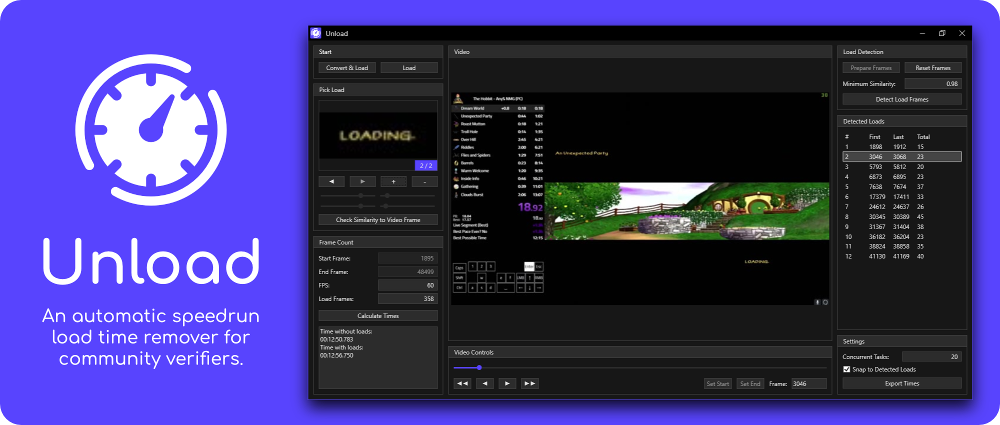
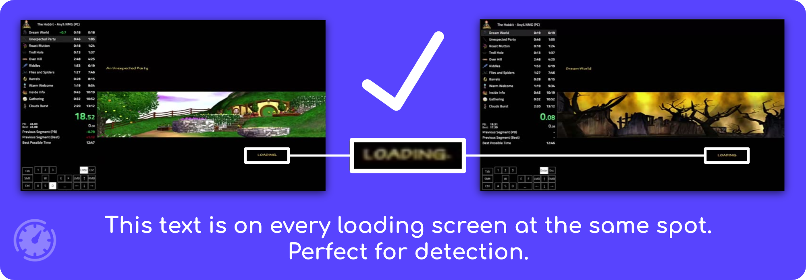

 

  

  <h2 align="center">Unload</h2>

  

    <i>An automatic speedrun load time remover for community verifiers.</i>
     
    <a href="../../issues">Report Issue</a>
    -
    <a href="../../issues">Request Feature</a>
      -
    <a href="https://www.youtube.com/watch?v=tgFAWxCUGZY">In Depth Video Guide</a>
  

# Table of Contents

* [About](#about)
* [Features](#features)
* [Usage](#usage)
* [Download](#download)
* [Will my game work with Unload?](#will-my-game-work-with-unload)
* [Extra Info](#extra-info)
* [Credits](#credits)

# About

Speedrun timing is a tricky subject. A community doesn't want to give anyone an unfair advantage, but you also don't want the timing and verification process of new runs to take too long. Unload is made to help with those speedruns that choose loadless timing, yet suffer from having a lot of loads. I ran into this problem with speedruns of the game "The Hobbit" which I verify - and thus Unload was born.

If the game you verify has consistent recognizable loading screens then Unload should be able to detect them all and give accurate loadless timing.

**Unsure if your speedrun videos will work with Unload? [Read this!](#will-my-game-work-with-unload)**

  

 

# Features
* Choose one or more images of loading screens and Unload will detect them throughout the VOD.
* There's a clear list of every load screen that you can interact with to double check your work.
* Just select a start and ending frame for a perfect framecount.
* You choose the loading frame from the same video you verify, so even bad video quality load screens can be recognized.
* Unload uses FFMpeg, meaning it can work with many video formats.
* You can export to a CSV sheet to keep a clean log of verifications.
* Options to crop and change VODs for fast processing

# Usage

*I designed Unload to feel similar to other programs used for verifying like VirtualDub, if you're familiar with something like that then a lot of things should make sense right away.*

**If you would rather watch an in depth video guide then go [here](https://www.youtube.com/watch?v=tgFAWxCUGZY).**

First hit the "Convert and Load" button and select the video to review. You'll see some options for converting. The default values are fine but an advanced user might choose to tweak these. Hitting convert here will convert the video to images so Unload can use them, depending on your hardware and the length of the video this could take a while.

Next navigate through the timeline using the large slider and back/forward buttons to find the first frame of gameplay, or wherever your community starts timing. Once done hit "Set Start". Do the same for the last frame of gameplay with "Set End".

Next find a frame of a loading screen and hit "+" in the "Pick Load" panel. Now use the sliders below the button to crop to the recognizable part of the loading screen. The smaller you make this the faster hashing will finish. If you have multiple different looking loading screens you can hit "+" again to add another. Note that every picked loading frame will use the same cropping.

Optionally you can fine tune the similarity for what Unload detects as a loading screen. You can navigate through various points in your video and hit "Check Similarity to Video Frame" and find a number lower than the similarity you see on loading screens, but higher than regular gameplay.

Finally hit "Prepare Frames". When that is done you can now hit "Detect Load Frames". The list on the right will now fill up with every loading screen found, and you'll see your final times in the bottom left.

You can click the loading screens in the list to see the frames they start and you can also move around the timeline which will now snap to the start and end of loading screens. I recommend you double check the loading screens at this point. If anything is off you can easily tweak the similarity and detect load frames again. But if you want to make a larger change like changing the cropping of picked loading screen; you'll have to reset frames first.

# Download

Download the most recent release [here](../../releases). Simply open the zip file and extract the full "Unload" folder the location where you want to keep it. Then you can run the Unload.exe file inside the folder, and you're up and running!

Unfortunately Unload will likely only ever be available for Windows as porting it would take a ton of effort.

# Will my game work with Unload?

To answer this you'll have to look at how your game looks when it loads:

- If your loading screens contain a logo, image or anything that's distinct on every load screen then there's a great chance Unload can detect it.

- If you have a set of different looking loading screens and all are clearly different from gameplay then there's a great chance you can choose them all and Unload can detect them.

- If your loading screens are pure black screens, Unload *might* work but you would have to be very careful that no non-loading black screens get picked up.

- If you have a distinct point but its animated, then you might be out of luck because Unload compares against static images.

And if you're still not sure, there's never harm in trying.

  
      <i>An easy to detect load screen in the game "The Hobbit."</i>
   

# Extra Info

Here I'll answer some things you might be wondering in a questions-and-answers format.

**How does Unload work behind the scenes?**  

*Unload calculates something callled a Perceptual Hash (PHash) for every video frame as well as the picked loading frames. Using this PHash it can compare how similar the video frames are to the picked loading frames and if they are similar enough they can be confidently counted as load frames. From there it's simple math to subtract the load frames from real time.*

**Why does every loading screen need the same cropping?**  

*This is because Unload applies the same loading frame cropping to every video frame before PHashing it. If there are multiple different croppings that would mean ***all*** video frames would have to be PHashed multiple times, multiplying processing time for every new load frame.*

**How can I speed up conversion?**  

*The best way to go about speeding up conversion is to work with less video data. You can set the start and end time to be closer to the start and end of the run where applicable to avoid converting as many frames.  
You might also be able to lower the framerate if, for example, the game has a locked framerate at 30 FPS but the video is recorded at 60.  
Last but not least you can lower the export width and height, but know that this won't speed up conversion a lot and if the quality gets too low then loading frames might be harder to recognize.*

**How can I speed up frame preperation?**  

*Frame preparation is very dependent on the size of your loading screen cropping. If you hardly crop at all, then the process will likely take a long time. Thus try to find something smaller yet distinct on your loading screens to be recognized and crop to that when possible.
Finally you can try upping the "Cocurrent Tasks" option in the bottom right. This will allow more frames to be prepared at the same time, but note that putting this value too high might backfire instead.*

**Does Unload support alpha masks for loading frames?**  

*No, this is not supported yet. But it's something I would like to add eventually.*

**Can unload work on live runs together with my timer?**  

*No, Unload is purely designed for verification purposes.*

**What does it mean when Unload tells me "Fewer converted frames are found than expected"?**  

*When Unload loads in your video file it checks how many frames it expects there to be in the video. It then checks how many frames it finds in your converted "_frames" folder. If this is less than it expects then there's a chance some frames might be missing, possibly due to a conversion error. The warning is just to make you aware of this, as there's a chance that might lead to innacurate load time calculation.*

# Credits

- [Xabe.FFMpeg Library](https://ffmpeg.xabe.net/index.html): FFMpeg Library
- [Shipwreck.Phash](https://github.com/pgrho/phash): Phash Library
- [Shockster](https://github.com/Shockster218): Support and feedback
