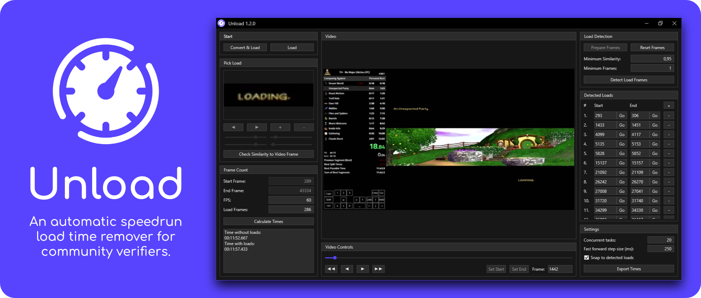

 

  

  <h2 align="center">Unload</h2>

  

    <i>An automatic speedrun load time remover for community verifiers.</i>
     
    <a href="../../issues">Report Issue</a>
    -
    <a href="../../issues">Request Feature</a>
  

# Table of Contents

* [About](#about)
* [Features](#features)
* [Usage](#usage)
* [Download](#download)
* [Will My Game Work With Unload?](#will-my-game-work-with-unload)

# About

Speedrun timing is a tricky subject. A community doesn't want to give anyone an unfair advantage, but you also don't want the timing and verification process of new runs to take too long. Unload is made to help with those speedruns that choose loadless timing, yet suffer from having a lot of loads. I ran into this problem with speedruns of the game "The Hobbit" which I verify - and thus Unload was born.

If the game you verify has consistent recognizable loading screens then Unload should be able to detect them all and give accurate loadless timing.

**Unsure if your speedrun videos will work with Unload? [Read this!](#will-my-game-work-with-unload)**

Note that converting and hashing VODs can take a while depending on your hardware, but you can just leave that going in the background.

  

 

# Features
* You only pick one loading frame and Unload finds the rest.
* There's a clear list of every load screen that you can interact with to double check.
* Just select a start and ending frame for a perfect framecount.
* You choose the loading frame from the same video you verify, so even bad video quality load screens can be recognized.
* Unload uses FFMpeg, meaning it can work with many video formats.
* You can export to a CSV sheet to keep a clean log of verifications.

# Usage

*I designed Unload to feel similar to other programs used for verifying like VirtualDub, if you're familiar with that then a lot of things should make sense right away.*

First hit the "Convert and Load" button and select the video to review. This will convert the video to images so Unload can use them, depending on your hardware and the length of the video this could take a while.

Next navigate through the timeline using the large slider and back/forward buttons to find the first frame of gameplay, or wherever your community starts timing. Once done hit "Set Start". Do the same for the last frame of gameplay with "Set End".

Next find a frame of a loading screen and hit "Pick Frame as Load Frame". Now use the sliders below the button to crop to the recognizable part of the loading screen. The smaller you make this the faster hashing will finish.

Optionally you can fine tune the similarity for what Unload detects as a loading screen. You can navigate through various points in your video and hit "Check Similarity to Video Frame" and find a number lower than the similarity you see on loading screens, but higher than regular gameplay.

Finally just "Index Frame Hashes". When that is done you can now hit "Detect Load Frames". The list on the right will now fill up with every loading screen found, and you'll see your final times in the bottom left.

You can click the loading screens in the list to see the frames they start and you can also move around the timeline which will now snap to the start and end of loading screens. I recommend you double check the loading screens at this point. If anything is off you can easily tweak the similarity and detect load frames again. But if you want to make a larger change like changing the picked loading screen; you'll have to clear the frame hashes first.

# Download

Download the most recent release [here](../../releases). Simply open the zip file and extract the full "Unload" folder the a location you want to keep it. Then you can run the Unload.exe file inside the folder, and you're up and running!

Unfortunately Unload will likely only ever be available for Windows. Please don't bother asking about other platforms.

# Will my game work with Unload?

To answer this you'll have to look at how your game looks when it loads:

- If your loading screens contain a logo, image or anything that's distinct, and there on every load screen then there's a great chance Unload can detect it.

- If you have a distinct point, but it moves around with animations, you might be out of luck because Unload expects it to always be in the same spot.

- If your loading screens are pure black screens, Unload could work but you would have to be careful that no non-loading black screens get picked up.

- And if you're still not sure, there's no harm in trying.

  
      <i>An easy to detect load screen in the game "The Hobbit."</i>
   

